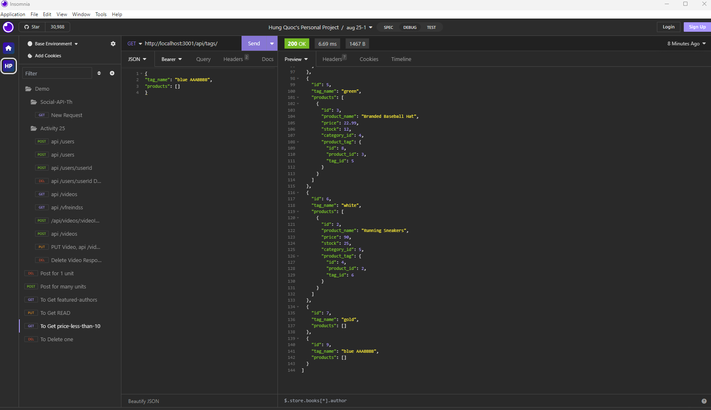

# ORM_Ecommerce by Hung Quoc Dang

## Summary

To create the database in MySQL Workbench 8.0 CE version 8.0.33
DROP DATABASE IF EXISTS ecommerce_db;
CREATE DATABASE ecommerce_db;

then clone the codes, then do  
npm i
npm run seed
npm run watch

Open Heroku and apply these lines below:

Demo: 

GitHub link:  https://github.com/HungQuocDang/ORM_Ecommerce

GitHub Deployed link:  https://hungquocdang.github.io/ORM_Ecommerce/

Heroku:  Application error

1. get all categories and one category by id:

GET http://localhost:3001/api/categories/1

GET http://localhost:3001/api/categories/

2. delete one category by id:

DELETE http://localhost:3001/api/categories/1

3. Create a new category:

POST http://localhost:3001/api/categories/

json, input:
{
"category_name": "Shirts  AAA",
"products": [{
"id": 4,
"product_name": "Top AAA Record",
"price": 12.99,
"stock": 50,
"category_id": 3
}]	
}

4. Update a category by its `id` value:

PUT http://localhost:3001/api/categories/5

json, input:

{
"id": 5,
"category_name": "Shirts  ccccccc",
"products": []
}

++++

5. get all products and one product by id:

GET http://localhost:3001/api/products/

GET http://localhost:3001/api/products/2

6.  create a product:

POST http://localhost:3001/api/products/

Json, input:

{
"product_name":  "Shirts  FFFF",
"price": 909,
"stock": 259,
"tagIds": []	
}

7. Delete a product by id:

DELETE http://localhost:3001/api/products/5

8. Update a product with the use of product id:

PUT http://localhost:3001/api/products/5

json, input:

{
"product_name": "Cargo AAAA",
"price": 9.99,
"stock": 220,
"category_id": null,
"category": null
}

++++

9. get all tags and a tag with id:

GET http://localhost:3001/api/tags/

GET http://localhost:3001/api/tags/2  **to check**

10. Delete a tag by its id:

DELETE http://localhost:3001/api/tags/3

11. Update a tag by its id:

PUT http://localhost:3001/api/tags/3

json, input:

{		
"id": 1,
"tag_name": "white rock music"
}

12. Create a new tag:

POST http://localhost:3001/api/tags/

json, input:

{
"tag_name": "blue AAABBBB",
"products": []
}

